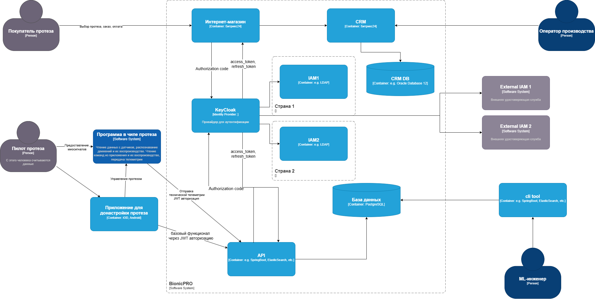

Все подзадачи выполнены в отдельных директориях. К некоторым добавлен
README файл, где отмечены детали реализации.

[Подзадача 2](subtask_2/README.md)

[Подзадача 3](subtask_3/README.md)

[Подзадачи 4-5](subtask_4-5/README.md)

[Подзадача 6](subtask_6/README.md)
