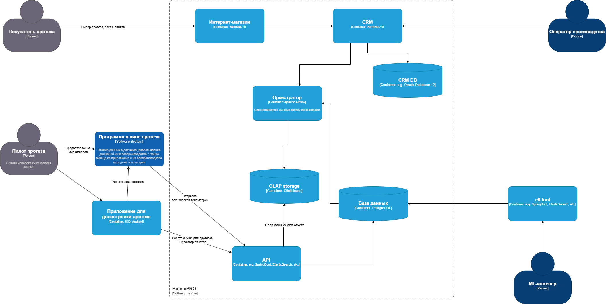
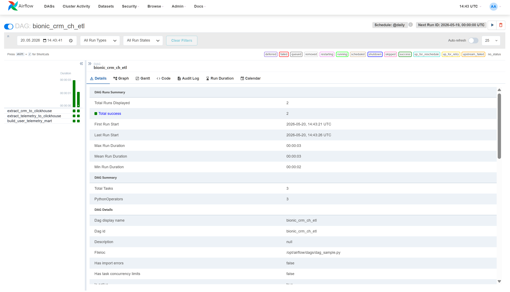
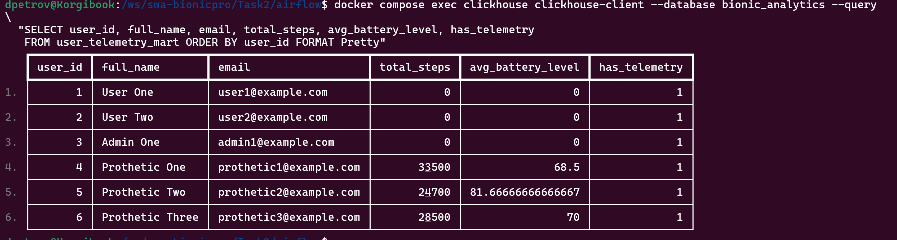
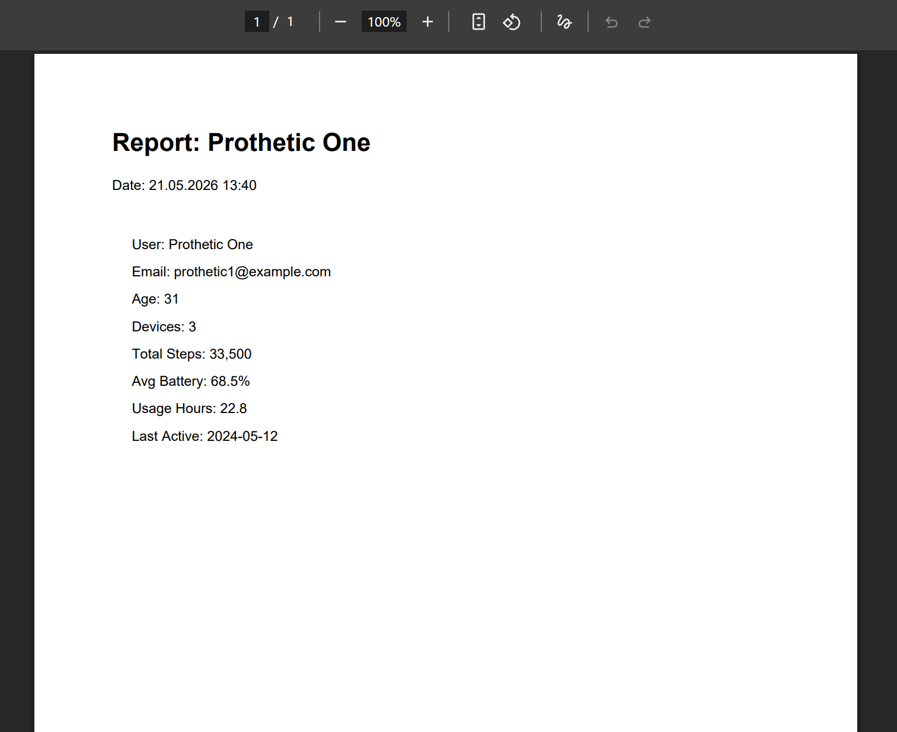

## Детали реализации

Запуск и сборка проекта:

`
docker compose build
`

`
docker compose up -d
`

После запуска необходимо пойти в Apache Airflow по адресу http://localhost:8081 и запустить 
пайплайн bionic_crm_ch_etl,
который соберет данные из двух баз PostgreSQL и создаст витрину — отдельную 
таблицу для сервиса отчётов в ClickHouse.

Потом можно идти в интерфейс фронт приложения, доступный по https://localhost, 
залогиниться под тестовым пользователем prothetic1 и скачать pdf-отчёт.

В сервисе reports есть переменная окружения MART_TABLE_NAME, в ней можно указать какую
витрину использовать для генерации отчета: созданную через Apache Airflow user_telemetry_mart 
или через Debezium user_telemetry_mart_cdc.

